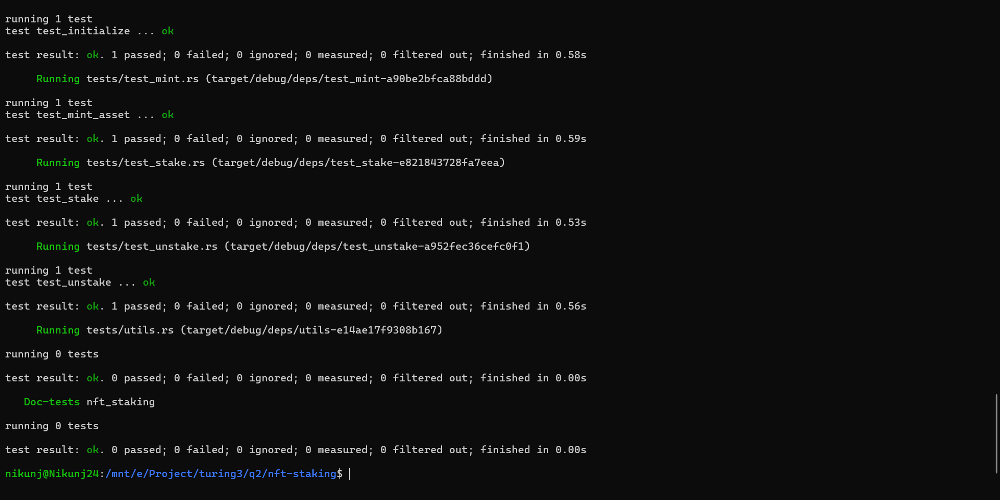

# NFT Staking Program (Anchor + MPL Core)



A Solana program built using **Anchor + Metaplex Core (MPL Core)** that allows users to:

* Create NFT collections
* Mint assets into collections
* Stake NFTs
* Earn time-based rewards
* Unstake NFTs after freeze period
* Claim rewards on-demand

Rewards are distributed using a **configurable reward basis points (BPS)** model.

---

# 🚀 Clone Repository

```bash
git clone https://github.com/your-repo/nft-staking
cd nft-staking
```

---

# ⚙️ Installation

## 🪟 Windows

Install WSL first:

Recommended:

* WSL2
* Ubuntu 22+

---

## 🍎 macOS / Linux

Install Solana toolchain:

```bash
curl --proto '=https' --tlsv1.2 -sSfL https://solana-install.solana.workers.dev | bash
```

Restart terminal after installation.

---

# 📦 Required Versions

```bash
Rust: 1.85.0+
Solana CLI: 3.1.10+
Anchor CLI: 0.31.1+
Node.js: v23+
Yarn: 1.22+
```

---

# 📁 Project Structure

```bash
.
├── programs/
│   └── nft-staking/
├── migrations/
├── Anchor.toml
└── README.md
```

---

# 🔨 Build Program

```bash
anchor build
```

---

# 🧪 Run Tests

```bash
anchor test
```

Run without rebuild:

```bash
anchor test --skip-build
```

Run specific test:

```bash
anchor test -- --test test_claim
```

---

# 🧠 Program Overview

This program implements an **NFT staking system using MPL Core assets**.

Each NFT stores staking state using **on-chain attributes plugin**:

* `staked: true/false`
* `staked_at: timestamp`

---

# ⚙️ Program Flow

---

## 1. Initialize

Creates core staking configuration.

### Accounts Created

* Config PDA
* Reward Mint (SPL Token)
* Collection validation binding

### Seeds

```rust
[b"config", collection.key().as_ref()]
[b"reward_mint", config.key().as_ref()]
```

### Purpose

* Set reward rate (BPS)
* Set freeze period (days)
* Initialize reward mint authority

---

## 2. Create Collection

Creates an MPL Core NFT collection.

### Features

* Uses CPI to Metaplex Core
* Sets update authority PDA
* Binds collection to staking config

---

## 3. Mint Asset

Mints NFT inside collection.

### Features

* Uses MPL Core V2 CPI
* Assigns owner
* Links to collection
* Initializes metadata

---

## 4. Stake NFT

Locks NFT into staking system.

### What happens:

* NFT becomes frozen
* Attributes updated:

  * `staked = true`
  * `staked_at = timestamp`

### Logic:

```text
NFT → Frozen state
Attributes updated
FreezeDelegate enabled
```

---

## 5. Unstake NFT

Unlocks NFT after freeze period.

### Checks:

* Must be staked
* Must respect freeze period

### What happens:

* `staked = false`
* `staked_at = 0`
* NFT is unfrozen
* Rewards are minted

---

## 6. Claim Rewards

Allows user to claim staking rewards without unstaking.

### Reward Formula

```text
reward = staked_days × reward_bps
```

### Calculation:

```text
(staked_time × reward_bps × 10^decimals) / 10000
```

### Output:

* SPL tokens minted to user ATA

---

# 🪙 Token System

## Reward Mint

* SPL token mint
* Controlled by Config PDA
* Minted during:

  * unstake
  * claim

---

## User ATA

Automatically created:

```rust
associated_token::get_associated_token_address(owner, reward_mint)
``